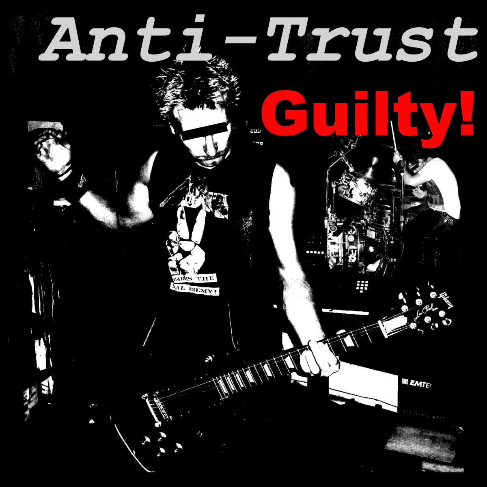

# Anti-Trust Guilty Album - Punk Rock Music
 
Anti-Trust is a Punk Rock music side project created by Rick Strahl, in collaboration with various former band members Chris Kontos and Andy Andersen. 

This GitHub repository holds all the content for the 14 song **Guilty** album release, including all the music files and support assests for this Punk Rock Album release. You can download both individual songs and the full album from here **for free**.

## Listen Online
You can check out and listen to all the music for this album on our Web Site:

* [Anti-Trust Guilty Web Site](https://anti-trust.rocks)

On that site you can find all the songs to browse through and play online, lyrics as well as old photos and band information.

## Download all Music
In addition to the Web Site I've also decided to make all the digital music and content available here for free. This Github Repository Site provides access to all of the music and support content that you can download from here:

* [Full Album Download as a Zip File](https://github.com/RickStrahl/anti-trust-guilty-album/raw/main/Anti-Trust-Guilty.zip)
* [Individual Song Downloads](https://github.com/RickStrahl/anti-trust-guilty-album/tree/main/Album)

## Print your own T-Shirts
Want an Anti-Trust T-Shirt? We're making artwork available, so you can print your own T-Shirts or other typical merchandise using readily available online services at Amazon and other retailers. You can download the T-Shirt Artwork and use any printing service (we provide a few links) to customize your own T-Shirt.

* [Print your own T-Shirts](https://anti-trust.rocks/t-shirt/)

## License
Any of the Anti-Trust Music provided on this site is **free for personal use**. You can freely download and share this music with your friends. The more the merrier!

We also allow for free use of this music for commercial use in online digital or other media content. However, for commercial use you are required to prominently **include the following copyright notice**:

**&copy; Anti-Trust Music**

You also have to provide an **explicitly visible back link** to the following Web Site, in any digital content that uses this music, and/or include this link on any pysically distributed content packaging:

https://anti-trust.rocks

## Want to Support us?
Help us out and spread the word! If you like what you hear, please share the [Anti-Trust.rocks](https://anti-trust.rocks) Web site or individual songs on Twitter or Facebook or other social media sites. You can also find our music on [BandCamp.com](https://anti-trust.bandcamp.com/) and sharing there helps out too

If you like what you're hearing, you can also buy a license or make a donation with an amount of your choice. 

**Pay it forward with value for value.**

### Credit Card or PayPal

* [Official Album License](https://store.west-wind.com/product/order/antitrust_guilty) <small>(from online store: credit cards, PayPal)</small>
* [Donate with PayPal](https://www.paypal.com/donate?hosted_button_id=GRGZEC46JJL3Q)

### Crypto Donations

* Bitcoin: **14K93auLNxV7jzpRfwbPnPpP3Ak4CV6euy** 
* Ethereum: **0xE68B4db95b7F4aE943Adf63d2b8E7098c14A4802**