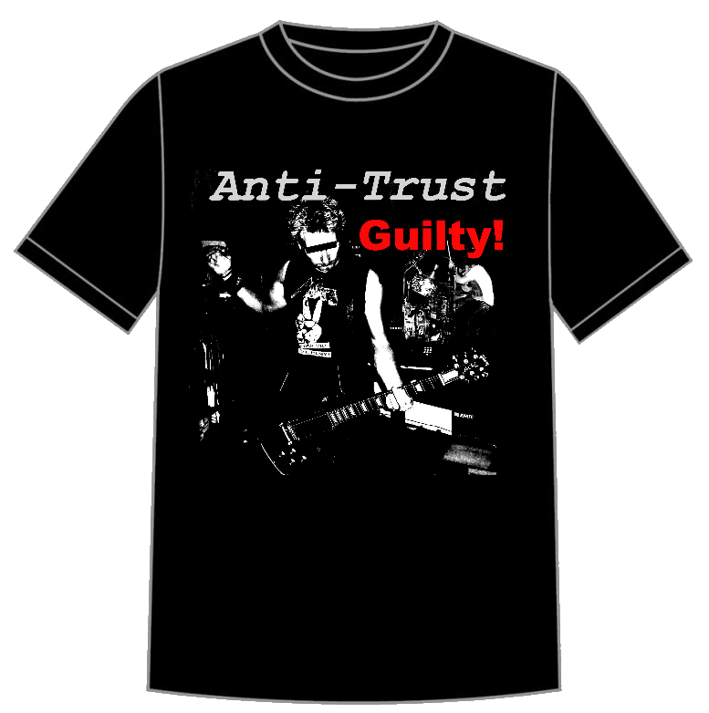
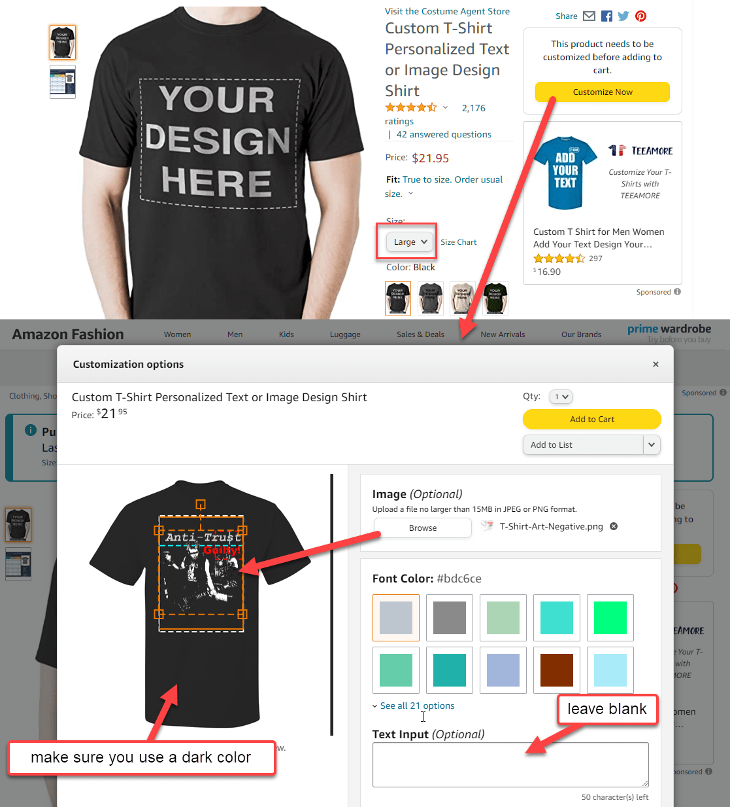

# Print your own Anti-Trust T-Shirt

Want an Anti-Trust Guilty T-Shirt? In the open source spirit **you can make your own T-shirts**! This folder contains a `png` transparent image file that you can use to print your own T-Shirts, hats, patches etc.

The image contained here is a **negative image** of the Guilty cover logo (ie. white/red foreground with transparent background), which means it **will only work for printing onto a  black or dark background**.

[Open and Save T-Shirt Image](T-Shirt-Art-Negative.png){target="_blank"}

### Links to Amazon Vendors printing Shirts
You can easily get T-Shirts printed online these days at Amazon or other online retailers. You can provide the artwork provided here and order and pay for your shirts directly through Amazon.

Here are a couple of Amazon vendors I've used personally to print these shirts and that provide good prints and decent quality shirts:

* [Hopen Brand Custom T-Shirt](https://amzn.to/3bOIPgJ)
* [Custume Agent Store T-Shirt](https://amzn.to/3oHCOaB)

Here's on vendor on Amazon Germany - but haven't used them:

* [4sold (Amazon.de)](https://www.amazon.de/gp/product/B07SQQG91H)

<small>*(if you find other online vendors that print shirts of good quality and good prices please [edit this page](https://github.com/RickStrahl/anti-trust-guilty-album/blob/main/anti-trust.rocks/t-shirt/README.md) and add a link)*</small>

Here are the steps to do this yourself:

* [Open the T-Shirt Image](T-Shirt-Art-Negative.png)
* Use the Browser's *Save Image As...* Context Menu to save to a file
* Go to [Hopen Brand Custom T-Shirt](https://amzn.to/3bOIPgJ)  
or [Custume Agent Store T-Shirt](https://amzn.to/3oHCOaB)
* Pick a T-Shirt Size (both run a little small)
* Click the **Customize Now** Button
* Click the **Browse** button for the Image to load
* Find and select the image you saved (T-Shirt-Art-Negative.png)
* Leave the text input blank!
* Add to Cart

Each of these Amazon T-Shirt sites works similar but the text and verbiage might be slightly different.