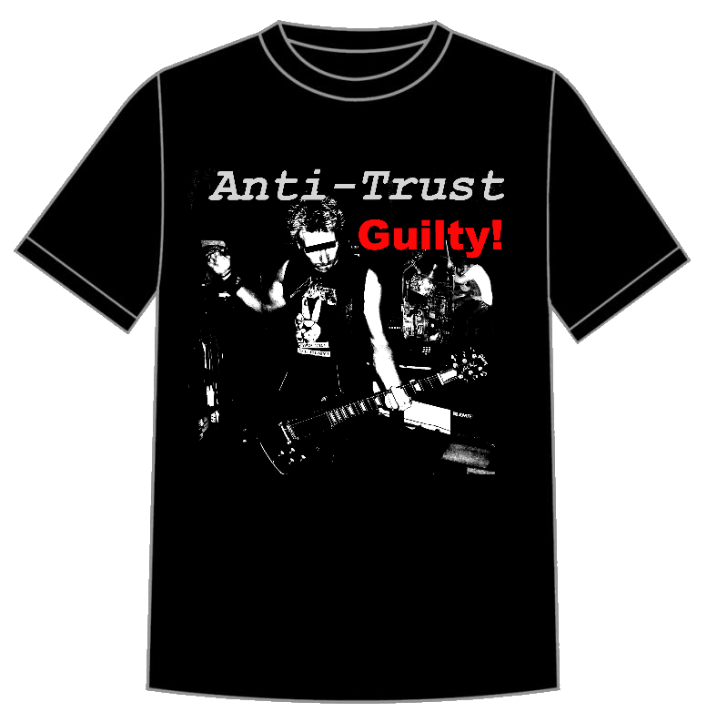

# Get the T-Shirt

Want an Anti-Trust Guilty T-Shirt? In the open source spirit **you can make your own T-shirts** or buy a T-Shirt directly from us! 

### Buy a Ready-Made T-Shirt
You can buy a ready-made T-Shirt from our merchandise shop at:

* [Anti-Trust Merchandise](https://anti-trust-merchandise.printify.me/products)

There are several designs to choose from.

### Print your own T-Shirts using Amazon Vendors printing Shirts
You can download a  transparent image `png` file, that you can use to print your own T-Shirts, hats, patches etc. The image contained here is a **negative image** of the Guilty cover logo (ie. white/red foreground with transparent background), which means it **will only work for printing onto a black or dark background surfaces**.

**Negative Images for Black T-Shirts**

* [Guilty Album Cover](T-Shirt-Art-Negative.png){target="_blank"}
* [The Masters of Disaster](T-Shirt-Masters-Of-Disaster-Negative.png){target="_blank"}
* [War is the Real Enemy](T-Shirt-War-Is-The-Real-Enemy.png)

There are a number of shops online that you can use to get T-Shirts Printed and shipped to you. 

Here are a couple of Amazon vendors I've used personally to print these shirts and that provide good prints and decent quality shirts:

* [Awkward Styles Store](https://amzn.to/3vO0MIV)
* [Custume Agent Store T-Shirt](https://amzn.to/3oHCOaB)

Here's on vendor on Amazon Germany - but haven't used them:

* [4sold (Amazon.de)](https://www.amazon.de/gp/product/B07SQQG91H)

<small>*(if you find other online vendors that print shirts of good quality and good prices please [edit this page](https://github.com/RickStrahl/anti-trust-guilty-album/blob/main/anti-trust.rocks/t-shirt/README.md) and add a link)*</small>

Here are the steps to do this yourself:

* [Open the T-Shirt Image](T-Shirt-Art-Negative.png)
* Use the Browser's *Save Image As...* Context Menu to save to a file
* Go to [Hopen Brand Custom T-Shirt](https://amzn.to/3bOIPgJ)  
or [Custume Agent Store T-Shirt](https://amzn.to/3oHCOaB)
* Pick a T-Shirt Size (both run a little small)
* Click the **Customize Now** Button
* Click the **Browse** button for the Image to load
* Find and select the image you saved (T-Shirt-Art-Negative.png)
* Leave the text input blank!
* Add to Cart

Each of these Amazon T-Shirt sites works similar but the text and verbiage might be slightly different.

